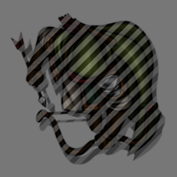

[](https://github.com/dev7355608/gm-vision/releases/latest)

[](https://forge-vtt.com/bazaar#package=gm-vision)
[](LICENSE)

# GM Vision (Foundry VTT Module)

This module adds a toggleable mode for GMs that ...

- increases the brightness of the scene,
- reveals the fog of war, and
- shows all tokens even if they wouldn't be visible normally from the perspective of the controlled token(s).

Tokens that wouldn't be visible normally are highlighted by a hatched overlay.



The mode can be toggled by a keybinding (default: `CTRL+G`), by right-clicking the lighting controls button, or with a script macro. The light bulb icon of the lighting controls button indicates whether it's active (: inactive; : active).

```js
game.settings.set("gm-vision", "active", !game.settings.get("gm-vision", "active"));
```
